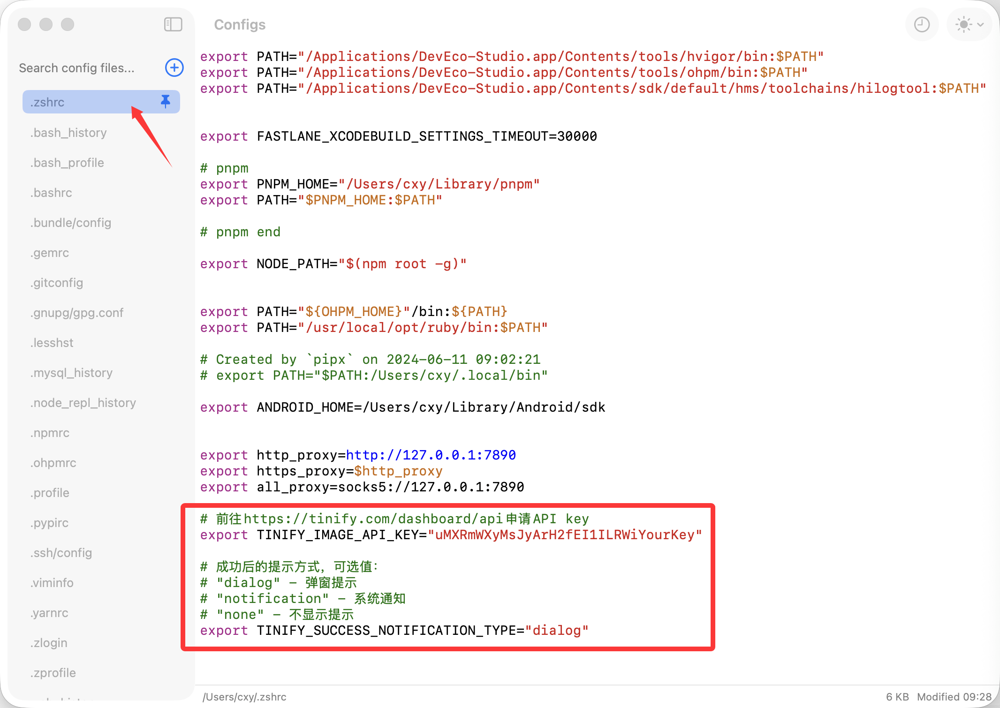
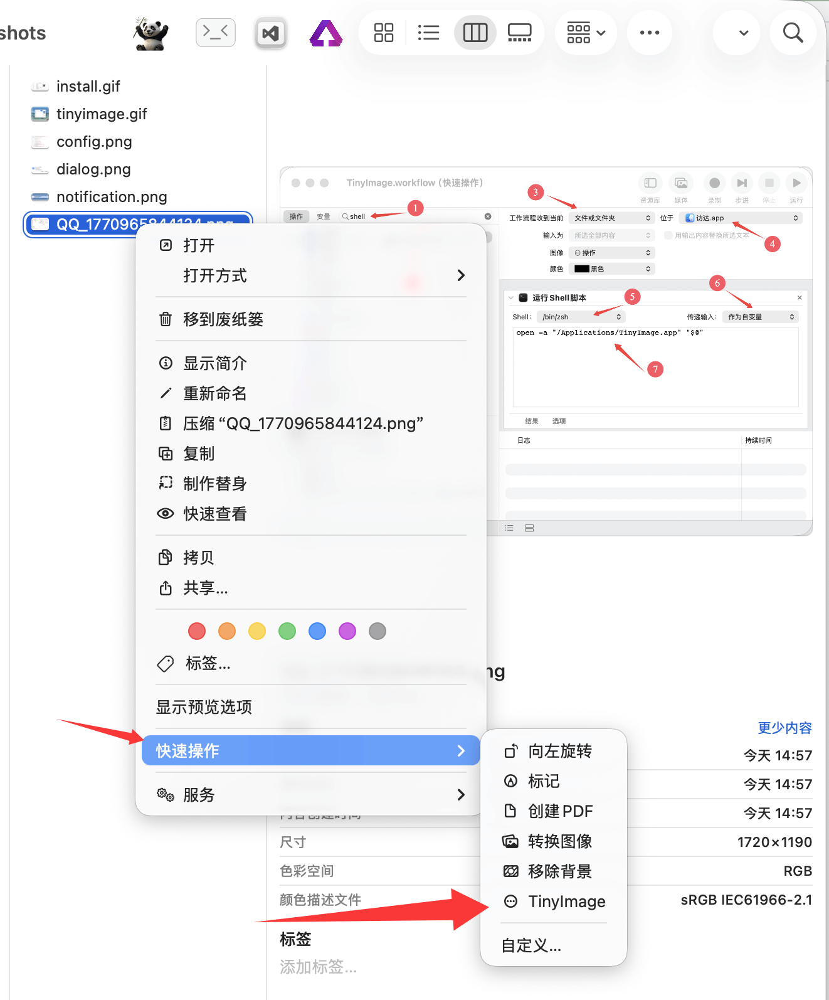

# [TinyImage](https://github.com/iHongRen/TinyImage)

一个基于 Tinify API 的 macOS 图片压缩工具，直接在Finder工具栏或者右键菜单上操作图片压缩，简单快捷。

[English README](./README_EN.md)

## 功能特点

- 便捷操作：集成到 Finder 工具栏，一键压缩
- 批量处理：支持多个图片或整个目录的批量压缩
- 灵活提示：支持弹窗、通知或静默三种提示方式
- 右键菜单：借助`自动操作`实现右键TinyImage菜单项
- 依赖Tinify支持的图片格式：png、jpeg、jpg、webp、avif


## 安装步骤

1. 下载 [TinyImage.dmg](https://github.com/iHongRen/TinyImage/releases/download/1.0/TinyImage.dmg) ，双击后将 `TinyImage.app` 拖放到 `/Applications`（应用程序）文件夹中
2. 去除隔离属性（重要）：打开终端，执行以下命令
   ```bash
   xattr -d com.apple.quarantine /Applications/TinyImage.app
   ```
   > 由于应用未签名，macOS 会阻止其运行。此命令会移除隔离属性，允许应用正常使用。
3. 在应用程序中，按住 `⌘ Command` 键，使用鼠标将 `TinyImage.app` 拖动到 Finder 工具栏上


## 配置

1. 前往 [Tinify Dashboard](https://tinify.com/developers) 申请免费 API Key（每月可免费压缩 500 张图片，且不受5M大小限制）

2. 在环境变量配置文件（`~/.zshrc`、`~/.bash_profile` 或 `~/.bashrc` ）中添加 API Key 和提示方式

```bash
export TINIFY_IMAGE_API_KEY="your_api_key_here"
export TINIFY_SUCCESS_NOTIFICATION_TYPE="dialog"
# 可选值：
# - `dialog` - 弹窗提示
# - `notification` - 系统通知
# - `none` - 不显示提示
```

3. 终端执行 `source ~/.zshrc`（或对应的配置文件 `source ~/.bash_profile`）使其生效。

如果你不熟悉环境变量配置，可使用 [ConfigEditor](https://github.com/iHongRen/configEditor) 更方便的对环境变量配置文件修改，保存后直接生效。




## 使用方法

### 通过 Finder 工具栏使用（推荐）

1. 在 访达(Finder) 中选择要压缩的图片文件或包含图片的文件夹

2. 点击工具栏上的 TinyImage 图标

3. 首次使用时，需同意权限请求。

>  如果不小心点了拒绝，可前往 `隐私与安全性` > `自动化` > `TinyImage.app` 打开访达访问权限

4. 压缩，这个过程需要上传>压缩>下载，时间可能有点长，耐心等待压缩完成


### 源码执行，通过命令行使用

```bash
# 压缩单个文件
./TinyImage.sh image.jpg

# 压缩多个文件
./TinyImage.sh image1.jpg image2.png image3.webp

# 压缩整个目录
./TinyImage.sh /path/to/images/

# 混合使用
./TinyImage.sh image.jpg /path/to/images/
```


## 输出说明

压缩后的图片会保存在原文件所在目录的 `tinified` 子文件夹中。如果 `tinified` 文件夹已存在，会自动创建 `tinified(1)`、`tinified(2)` 等文件夹。

示例：
```
原始目录/
├── image1.jpg
├── image2.png
└── tinified/
    ├── image1.jpg  (压缩后)
    └── image2.png  (压缩后)
```


## 右键菜单

借助`自动操作`，为选中的文件，加上右键快速操作TinyImage菜单项.




在macOS App启动器中搜索 '自动操作'，打开`自动操作`应用，新建选择`快速操作`，按照下面的流程操作完成后，保存命名为TinyImage。这样右键菜单中就会出现 `TinyImage` 菜单项了


## 支持

如果本工具帮助您提升了一点点工作效率，欢迎 Star 加继续关注。

赠送一杯咖啡吗？ [💖赞助开发者](https://ihongren.github.io/donate.html)

